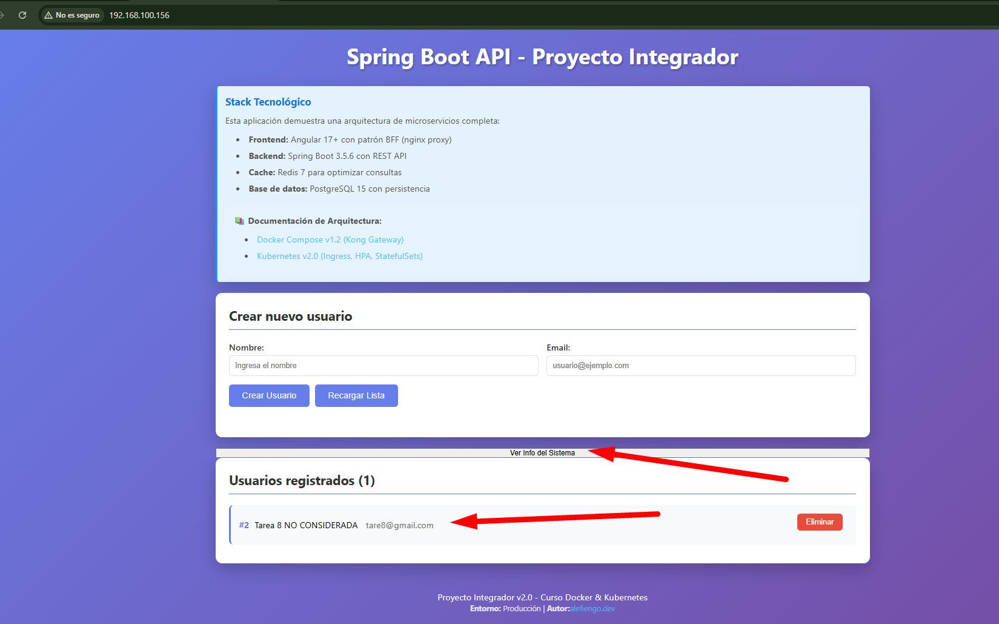
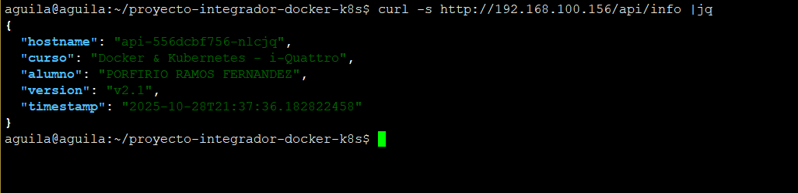
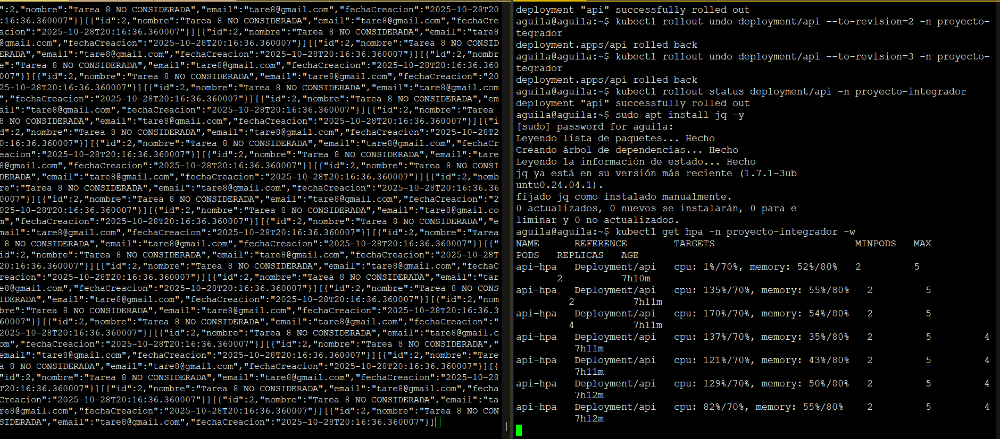

# Proyecto Final - Docker & Kubernetes

👉 **Alumno:** PORFIRIO RAMOS FERNANDEZ

👉 **Fecha:** 2025-10-28

👉 **Curso:** Docker & Kubernetes - i-Quattro

## Links de Docker Hub

- Backend v2.1: https://hub.docker.com/r/fast777/springboot-api/tags
- Frontend v2.2: https://hub.docker.com/r/fast777/angular-frontend/tags

## 🛠 Parte 1: Setup del Ambiente
**Ambiente utilizado:**
- [VMware]
- **Nombre de VM/Instancia:** porfirio-ramos-k8s
- **Sistema operativo:** Ubuntu 24.04 LTS
- **Recursos:** 8GB RAM, 2 CPU cores
- **Red configurada:** Bridged
- **Rango MetalLB:** 192.168.1.150 - 192.168.1.160
### Screenshots
```bash
echo "Hostname: $(hostname)"
microk8s status --wait-ready

```
 
 
```bash
kubectl get all -n proyecto-integrador
```
 
 
 
 
 

## 🛠 Parte 2: Backend v2.1
### Código Agregado
   [Snippet del endpoint /api/info]
> GreetingController.java
```java
import org.springframework.http.ResponseEntity;


@GetMapping("/api/info")
    public ResponseEntity<Map<String, Object>> getInfo() {
        Map<String, Object> info = new HashMap<>();
        info.put("alumno", "PORFIRIO RAMOS FERNANDEZ");
        info.put("version", "v2.1");
        info.put("curso", "Docker & Kubernetes - i-Quattro");
        info.put("timestamp", LocalDateTime.now().toString());
        info.put("hostname", System.getenv("HOSTNAME"));
        return ResponseEntity.ok(info);
    }


```

### Screenshots
   
> Screenshot de docker images mostrando la imagen v2.1

   

> Link a la imagen en Docker Hub:: https://hub.docker.com/r/fast777/springboot-api  

   
> Screenshot de kubectl rollout status durante la actualización
   
   

   
   
   

> Screenshot de kubectl get pods mostrando los pods con la nueva versión
> 
   
   
> Screenshot o output de curl http://<IP-METALLB>/api/info mostrando la respuesta JSON

   

## 🛠 Parte 3: Frontend v2.2
   [Descripción de cambios en Angular]
> **Código modificado de Angular (screenshots de .html y .ts)**
- app.component.html
```html
<div class="container">
  <h1>{{ title }}</h1>

  <!-- Información del sistema -->
  <div class="card info-section">
    <h3>Stack Tecnológico</h3>
    <p>
      Esta aplicación demuestra una arquitectura de microservicios completa:
    </p>
    <ul>
      <li><strong>Frontend:</strong> Angular 17+ con patrón BFF (nginx proxy)</li>
      <li><strong>Backend:</strong> Spring Boot 3.5.6 con REST API</li>
      <li><strong>Cache:</strong> Redis 7 para optimizar consultas</li>
      <li><strong>Base de datos:</strong> PostgreSQL 15 con persistencia</li>
    </ul>

    <div style="margin-top: 20px; padding: 15px; background-color: rgba(255,255,255,0.05); border-radius: 8px;">
      <p style="margin: 0 0 10px 0;"><strong>📚 Documentación de Arquitectura:</strong></p>
      <ul style="margin: 0; padding-left: 20px;">
        <li>
          <a href="https://github.com/alefiengoblob/main/ARCHITECTURE.md#arquitectura-docker-compose-v12"
            target="_blank" style="color: #4fc3f7; text-decoration: none;">
            Docker Compose v1.2 (Kong Gateway)
          </a>
        </li>
        <li>
          <a href="https://github.com/alefiengoblob/main/ARCHITECTURE.md#arquitectura-kubernetes-v20"
            target="_blank" style="color: #4fc3f7; text-decoration: none;">
            Kubernetes v2.0 (Ingress, HPA, StatefulSets)
          </a>
        </li>
      </ul>
    </div>
  </div>

  <!-- Mensajes -->
  <div *ngIf="error" class="error">
    {{ error }}
    <button class="btn btn-danger" (click)="clearMessages()" style="float: right; padding: 5px 10px;">✕</button>
  </div>

  <div *ngIf="success" class="success">
    {{ success }}
  </div>

  <!-- Formulario -->
  <div class="card">
    <h2>Crear nuevo usuario</h2>
    <form class="user-form" (ngSubmit)="createUser()">
      <div class="form-group">
        <label for="nombre">Nombre:</label>
        <input type="text" id="nombre" [(ngModel)]="newUser.nombre" name="nombre" placeholder="Ingresa el nombre"
          required>
      </div>

      <div class="form-group">
        <label for="email">Email:</label>
        <input type="email" id="email" [(ngModel)]="newUser.email" name="email" placeholder="usuario@ejemplo.com"
          required>
      </div>

      <div style="grid-column: 1 / -1;">
        <button type="submit" class="btn" [disabled]="loading">
          {{ loading ? 'Creando...' : 'Crear Usuario' }}
        </button>
        <button type="button" class="btn" (click)="loadUsers()" [disabled]="loading">
          Recargar Lista
        </button>
        <button type="button" (click)="getSystemInfo()" class="btn">
          Ver Info del Sistema
        </button>
      </div>
    </form>
  </div>
  <div *ngIf="systemInfo" class="card info-section">
    <h3>Información del Sistema</h3>
    <p><strong>Alumno:</strong> {{ systemInfo.alumno }}</p>
    <p><strong>Versión:</strong> {{ systemInfo.version }}</p>
    <p><strong>Curso:</strong> {{ systemInfo.curso }}</p>
    <p><strong>Timestamp:</strong> {{ systemInfo.timestamp }}</p>
    <p><strong>Pod:</strong> {{ systemInfo.hostname }}</p>
  </div>
  <!-- Lista de usuarios -->
  <div class="card">
    <h2>Usuarios registrados ({{ users.length }})</h2>

    <div *ngIf="loading" class="loading">
      Cargando usuarios...
    </div>

    <div class="users-list" *ngIf="!loading">
      <div *ngIf="users.length === 0" style="text-align: center; padding: 20px; color: #999;">
        No hay usuarios registrados. Crea el primero arriba.
      </div>

      <div *ngFor="let user of users" class="user-item">
        <div class="user-info">
          <strong>#{{ user.id }}</strong>
          <span>{{ user.nombre }}</span>
          <span style="color: #666; margin-left: 15px;">{{ user.email }}</span>
        </div>
        <div class="user-actions">
          <button class="btn btn-danger" (click)="deleteUser(user.id!)" [disabled]="loading">
            Eliminar
          </button>
        </div>
      </div>
    </div>
  </div>

  <!-- Footer -->
  <div style="text-align: center; color: white; margin-top: 30px; padding: 20px;">
    <p>Proyecto Integrador {{ version }} - Curso Docker & Kubernetes</p>
    <p style="font-size: 14px; opacity: 0.8;">
      <strong>Entorno:</strong> {{ environment }} |
      <strong>Autor:</strong> <a href="https://alefiengo.dev" target="_blank"
        style="color: #4fc3f7; text-decoration: none;">alefiengo.dev</a>
    </p>
  </div>
</div>
```
- app.component.ts
```ts
import { Component, OnInit } from '@angular/core';
import { CommonModule } from '@angular/common';
import { FormsModule } from '@angular/forms';
import { HttpClient } from '@angular/common/http';

interface User {
  id?: number;
  nombre: string;
  email: string;
}

@Component({
  selector: 'app-root',
  standalone: true,
  imports: [CommonModule, FormsModule],
  templateUrl: './app.component.html',
  styleUrls: ['./app.component.css']
})
export class AppComponent implements OnInit {
  title = 'Spring Boot API - Proyecto Integrador';
  users: User[] = [];
  loading = false;
  error: string | null = null;
  success: string | null = null;

  // Detección de versión basada en puerto
  version = 'v2.2';
  environment = 'Producción';

  newUser: User = {
    nombre: '',
    email: ''
  };

  // Información del sistema (nuevo)
  systemInfo: any = null;

  // API URL - Usa ruta relativa, nginx BFF proxy maneja el routing al backend
  private apiUrl = '/api/users';

  constructor(private http: HttpClient) {
    this.detectEnvironment();
  }

  ngOnInit(): void {
    this.loadUsers();
  }

  detectEnvironment(): void {
    const port = window.location.port;

    if (port === '4200') {
      this.version = 'v1.2-dev';
      this.environment = 'Desarrollo Local';
    } else {
      this.version = 'v2.0';
      this.environment = 'Producción';
    }
  }

  loadUsers(): void {
    this.loading = true;
    this.error = null;

    this.http.get<User[]>(this.apiUrl).subscribe({
      next: (data) => {
        this.users = data;
        this.loading = false;
      },
      error: (err) => {
        this.error = 'Error al cargar usuarios: ' + err.message;
        this.loading = false;
      }
    });
  }

  createUser(): void {
    if (!this.newUser.nombre || !this.newUser.email) {
      this.error = 'Por favor completa todos los campos';
      return;
    }

    this.loading = true;
    this.error = null;
    this.success = null;

    this.http.post<User>(this.apiUrl, this.newUser).subscribe({
      next: (user) => {
        this.success = 'Usuario creado correctamente';
        this.users.push(user);
        this.newUser = { nombre: '', email: '' };
        this.loading = false;
        setTimeout(() => this.success = null, 3000);
      },
      error: (err) => {
        this.error = 'Error al crear usuario: ' + (err.error?.error || err.message);
        this.loading = false;
      }
    });
  }

  deleteUser(id: number): void {
    if (!confirm('¿Estás seguro de eliminar este usuario?')) {
      return;
    }

    this.loading = true;
    this.error = null;
    this.success = null;

    this.http.delete(`${this.apiUrl}/${id}`).subscribe({
      next: () => {
        this.success = 'Usuario eliminado correctamente';
        this.users = this.users.filter(u => u.id !== id);
        this.loading = false;
        setTimeout(() => this.success = null, 3000);
      },
      error: (err) => {
        this.error = 'Error al eliminar usuario: ' + err.message;
        this.loading = false;
      }
    });
  }

  clearMessages(): void {
    this.error = null;
    this.success = null;  
  }

  // Nuevo método: obtiene información del sistema desde /api/info
  getSystemInfo(): void {
    this.http.get('/api/info').subscribe({
      next: (data) => {
        this.systemInfo = data;
        this.success = 'Información del sistema cargada';
        setTimeout(() => this.success = null, 3000);
      },
      error: (err) => {
        this.error = 'Error al obtener información del sistema';
        console.error('Error:', err);
      }
    });
  }
}


```
> **Link de la imagen en Docker Hub:**
* **https://hub.docker.com/r/fast777/angular-frontend/tags** 
### Screenshots
   
   
> **Screenshot de kubectl get pods -w durante el rolling update del frontend**

   

> **Screenshot del navegador mostrando el botón "Ver Info del Sistema"**

   

> **Screenshot del navegador mostrando la información del sistema cargada**

   

## 🛠 Parte 4: Gestión de Versiones

### ¿Qué hace kubectl rollout undo?
   [Tu explicación]

### Screenshots
 
> **Screenshot de kubectl rollout history del backend**

   

> **Screenshot de kubectl rollout history del frontend**

   

> **Screenshot del proceso de rollback (undo)**
> 
   

   

> **Screenshot verificando que /api/prueba/info dejó de funcionar después del rollback**

   

> **Screenshot del rollforward (undo --to-revision=3)**

   

   

   

> **Screenshot verificando que /api/prueba/info volvió a funcionar**

   

> **Explicación en tus propias palabras: ¿Qué hace kubectl rollout undo?**
- revierte un despliegue (deployment) a la versión anterior de la aplicación.
- Lo que hace internamente es: Guardar el historial de versiones (revisiones) del deployment. Cuando haces undo, aplica el template anterior (es decir, la configuración del pod antes del último cambio). 
Luego recrea los pods antiguos, reemplazando los fallidos.
## 🛠 Parte 5: Ingress + MetalLB

### Screenshots   
> **Screenshot de kubectl get ingress mostrando la IP asignada**


> **Screenshot de kubectl describe ingress mostrando las rutas configuradas**


> **Screenshot del navegador accediendo a http://192.168.100.156/ (frontend)**


> **Screenshot de curl a /api/info desde la IP de MetalLB**



> **Screenshot de curl a /actuator/health mostrando status UP**


IP del Ingress

   **IP del Ingress:** 192.168.100.156

   

## Conclusiones

### Aprendizajes principales
   - Docker, Dockerfile, Docker compose
   - Kubernetes


### Dificultades encontradas
   - Tuve problemas despues de apagar no pude levantar todos los servicios. tuve que eliminar todo y ahi perdi la version 2.0 es por eso para la parte 2 tuve que crear otro endpoint en el backend /api/prueba/info 
   - No tenia para hacer rollback, con el punto anterior pude solucionar el tema de 

### Reflexión

En proyectos grandes es mejor separar por namespaces:

**ingress:** todo lo que es Ingress Controller y servicios de exposición al exterior.

**proyecto-integrador (o por servicio):** aquí van los microservicios.

Esto te permite control de recursos y evitar conflictos de nombres.

**Servicios y Deployments**

**Cada microservicio tiene:** 
**Deployment:** define réplicas, imagen, recursos, readiness/liveness probes.

**Service:** Define cómo los pods se comunican entre ellos (ClusterIP para interno, LoadBalancer/NodePort para exposición).


## 🛠 Extra
### Validar HPA (Horizontal Pod Autoscaler)

> Generar carga desde un pod busybox: kubectl run -i --tty load-generator --rm --image=busybox --restart=Never -n proyecto-integrador -- /bin/sh -c "while true; do wget -q -O- http://api-service:8080/api/users; done"


> En otra terminal, observar: kubectl get hpa -n proyecto-integrador -w


> Screenshot de HPA mostrando el incremento de CPU y replicas



> Screenshot de kubectl get pods -n proyecto-integrador mostrando los pods adicionales creados


### Validar Health Probes

- Forzar fallo del backend (kill process dentro del pod)


- Screenshot de Kubernetes reiniciando el pod automáticamente


- Explicar cómo liveness probe detectó el fallo

La Liveness Probe utiliza el comando pg_isready para verificar si PostgreSQL está disponible.

Si el servicio no responde (como al matar el proceso de PostgreSQL), la probe falla.

Si la probe falla tres veces consecutivas, Kubernetes reinicia el pod automáticamente.

Esto garantiza que el sistema mantenga la disponibilidad, incluso si un contenedor o servicio falla.


### Persistencia de Datos
> Screenshot del proceso

> **Eliminar el pod de PostgreSQL**


> **Verificar que los datos persisten cuando se recrea**


> Prueba parte 3 aqui ya se registro tarea 8


